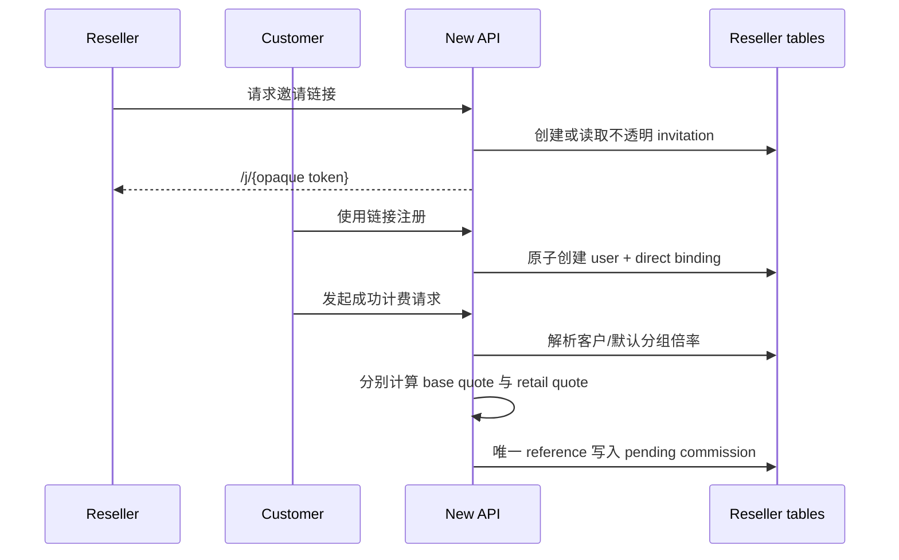
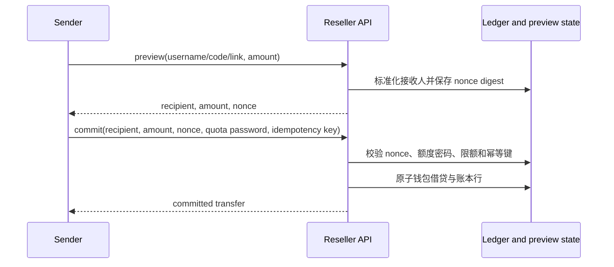
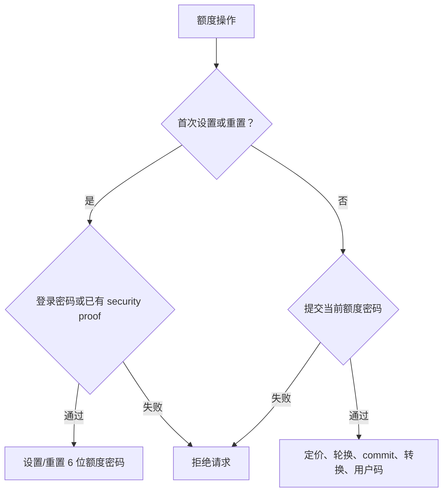

# 站长中心行为契约

本文档把目标站运行时、已服务前端资源和 New API 本地源码证据转化为可测试契约。目标后端不可见的内容必须标为“实现设计”或“待验证”，不得描述为逆向事实。

## 1. 证据来源

- 运行时页面：目标站已登录的 `/reseller` 路由。
- 运行时状态：目标版本 `r83-f34-email-bind-turnstile-r1-20260804`，公开状态包含 `reseller_enabled: true` 和 `tenant_key: primary`。
- 前端业务分块：`analysis/zzone-reseller/artifacts/static/js/async/3984.3771b86648.js`。
- 完整报告：`analysis/zzone-reseller/2026-08-04_web-reverse-zzone-reseller-report.md`。
- 本地源码：当前 New API `main` 基线 `353b702c2`。

证据优先级：运行时行为 > 已捕获网络 > 正在服务的资源 > 运行配置 > 持久状态 > 生成物 > 源码 > 注释或死代码。

## 2. 已确认业务契约

### 2.1 客户归属

- 邀请链接形态为 `/j/{opaque_token}`，不暴露内部用户 ID。
- 只有直属一级客户产生收益，间接客户不得向上游代理记账。
- 创建用户和绑定直属代理必须是同一原子业务操作。
- 来源枚举至少包括 `primary`、`reseller`、`admin`、`legacy_unknown`。
- 客户只允许一个有效直属代理归属。

### 2.2 定价

```text
RetailRatio(group) = PlatformRatio(group) * MultiplierBps / 10000
```

- `10000` 表示 `1.0000x`，观察到的范围为 `10000..100000`。
- 优先级：客户分组覆盖 > 客户整体 > 代理默认分组覆盖 > 代理默认整体。
- 首次设置立即生效；降低或保持倍率立即生效；提高倍率延迟 24 小时生效。
- 整体和每个分组独立维护当前值、待生效值、生效时间和版本。
- 更新请求带 `expected_version`；陈旧版本必须冲突失败，而非覆盖新状态。

### 2.3 收益

```text
BaseQuota = Bill(usage, platform ratio, all other billing inputs)
RetailQuota = Bill(usage, retail ratio, all other billing inputs)
Commission = max(RetailQuota - BaseQuota, 0)
```

- base 和 retail 必须使用相同计费分支与舍入规则。
- 仅最终成功结算的请求产生收益。
- 失败、取消、退款、上游超时或零用量不得产生净收益。
- 收益先进入 pending，在下一个北京时间 04:10 批次释放为 available。
- available 只能转换到代理自己的 API 钱包，不支持现金提现。

### 2.4 额度安全

- 使用独立六位数字额度密码。
- 首次设置或重置额度密码可使用登录密码，或使用已建立的 2FA / Passkey 安全复核；日常额度授权不复用该 proof。
- 修改额度密码只校验当前额度密码；定价、收款码轮换、转账 commit、收益转换和用户码签发/reveal 均只校验额度密码。
- 重置后发送额度和签发用户码冻结 24 小时，但仍允许接收额度。
- 收款码是 32 位字母数字公开标识；转账 preview 接受用户名、收款码或带 `receive` 参数的收款链接。
- 转账采用 preview/commit；preview 仅需要登录会话，commit 的 nonce 必须绑定发送人、标准化接收人、额度、过期时间并一次性消费，且提交额度密码。
- 转账、收益转换和用户码签发接受 `Idempotency-Key`。
- 同一 key 与相同 payload 返回原结果；同一 key 与不同 payload 必须拒绝。

### 2.5 限额与用户码

- 单次操作额度范围 `1..2000`。
- 转账和用户码签发共享滚动 24 小时 `4000` 限额。
- 单批最多 50 张用户码，批次备注最多 255 字符。
- 签发时立即从 API 钱包转入 escrow。
- 用户码一次性使用，不可取消、不可退款。
- 列表不返回明文；再次 reveal 必须验证额度密码。

## 3. API 契约

所有响应使用 `{success, data, message}` envelope。

### 3.1 读取

- `GET /api/reseller/status`
- `GET /api/reseller/invitation`
- `GET /api/reseller/customers`
- `GET /api/reseller/transfers`
- `GET /api/reseller/ledger`
- `GET /api/reseller/security`
- `GET /api/reseller/pricing/default`
- `GET /api/reseller/customers/{id}/pricing`
- `GET /api/reseller/vouchers`
- `GET /api/reseller/vouchers/batches`

### 3.2 写入

- `POST /api/reseller/profile`
- `POST /api/reseller/security/password`
- `PUT /api/reseller/security/password`
- `POST /api/reseller/security/password/reset`
- `POST /api/reseller/receive-address/rotate`
- `PUT /api/reseller/pricing/default`
- `DELETE /api/reseller/pricing/default`（删除分组覆盖并恢复继承）
- `PUT /api/reseller/customers/{id}/pricing`
- `DELETE /api/reseller/customers/{id}/pricing`（删除分组覆盖并恢复继承）
- `POST /api/reseller/transfers/preview`
- `POST /api/reseller/transfers/commit`
- `POST /api/reseller/commission/convert`
- `POST /api/reseller/vouchers`
- `POST /api/reseller/vouchers/batch`
- `POST /api/reseller/vouchers/{id}/reveal`
- `POST /api/reseller/vouchers/batch/{id}/reveal`
- `POST /api/reseller/vouchers/redeem`（登录用户兑换，不要求兑换人已开通站长中心）

### 3.3 旧邀请返利退役

- `GET /api/user/aff` 返回 `410 AFFILIATE_PROGRAM_RETIRED`，不再签发或展示旧邀请码。
- `POST /api/user/aff_transfer` 返回 `410 AFFILIATE_TRANSFER_RETIRED`，旧余额不能转换到钱包。
- 密码注册携带 `aff_code`、OAuth state 携带 `aff` 均返回 `410 AFFILIATE_PROGRAM_RETIRED`，不会创建用户或认证 flow。
- `users.aff_quota`、`users.aff_history`、`users.aff_code` 和历史记录保留用于数据库兼容与历史审计，但不再新增固定邀请奖励，也不迁移到 reseller 账本。

## 4. 必须保护的不变量

- 一个客户最多有一个直属代理绑定。
- 平台倍率修改无需重写代理规则即可影响下一次请求。
- 分组继承和独立 pending increase 不互相污染。
- 一个 request reference 最多产生一个 commission entry。
- ledger 中每次内部账户转移的借贷总额为零。
- release batch、转账 commit、收益转换、用户码签发和兑换均可安全重试。
- rolling window 限额在并发事务下不可超卖。
- 日志、响应、缓存和前端存储中不得出现额度密码、完整邀请 token、完整用户码或加密密钥。
- 每一条账本行保存该账户在该笔变动后的余额快照，列表按账户行展示 `account`、`delta_quota`、`balance_after`、`kind` 和 `created_at`。

## 5. Phase 9 对标流程

下列流程分别区分目标站已观察到的交互和本地 New API 的可验证实现；目标站不可见的数据库和服务端实现不从 UI 反推为事实。

### 5.1 总体架构


### 5.2 邀请绑定与双报价



### 5.3 转账 preview/commit



### 5.4 首次授权与日常额度授权



## 6. 实现设计，不属于目标站已确认事实

- 使用独立 `reseller_*` 表，而不是目标站真实表名。
- 使用 New API 现有 system-task lease 做多实例批次排他。
- 用户码使用 redemption digest 校验，同时保存 AEAD ciphertext 支持授权 reveal。
- commission 的权威唯一引用优先使用 New API request ID；不依赖可能位于独立日志库的 log ID。
- 旧 `users.inviter_id` 幂等回填成 `legacy_unknown`，旧返利额度不自动迁移。

## 7. 对标状态

- [x] 页面与静态资源契约提取完成。
- [x] API 方法和路径清单完成。
- [x] 定价优先级、延迟涨价和版本冲突契约完成。
- [x] pending/available/convert 资金边界完成。
- [x] 本地核心模型和解析器测试。
- [x] 本地注册归属测试。
- [x] 本地全计费路径双报价测试：比例价、固定价、缓存/工具附加费、阶梯表达式、Audio/WSS、Midjourney、图片/视频任务及异步 token 重算均保留同输入 base/retail quote；commission reference 有数据库唯一约束和并发重放测试。
- [x] 本地 pending/available 复式账本与释放测试：accrual/release journal 借贷和为零，余额投影与 commission 状态同事务更新，投影不一致整体回滚，system-task lease 下可恢复重放。
- [x] 本地资金操作与并发测试：六位额度密码、重置冻结、preview/commit nonce、幂等收益转换/转账/用户码、共享滚动限额、escrow/reveal/redeem 与账本平衡均有事务测试和 race detector 覆盖。
- [x] 本地 API 契约测试：完整路由、owner scope、分页、稳定错误码、security proof、幂等键、审计脱敏、读取 DTO 脱敏和旧返利 mutation 退役均已实现；Redis quota cache 在资金事务成功后刷新。
- [x] 本地前端逻辑测试：`/j/{token}` 使用 sessionStorage 并清理遗留 `aff`，注册/OAuth 成功后清理邀请；钱包 `RV-` 路由选择、服务端安全复核错误展示和列表分页已实现。
- [x] 本地前端逐视图与跨视口测试：SQLite 预览在 `1440x900` 和 `390x844` 完成六个标签及默认/客户定价、收益转换、preview 转账、签发、reveal、额度密码和地址轮换入口检查；页面无全局横向溢出，移动 Tabs/表格独立横滚，弹窗位于视口内。无账本时 `items: null` 引发的 500 已通过后端空数组契约和前端兼容归一化修复并回归。
- [x] 三数据库迁移检查：SQLite、MySQL `5.7.44` 和 PostgreSQL `9.6.24` 均创建 14 张 `reseller_*` 表及四个关键唯一索引；MySQL 数据库必须使用 `utf8mb4`，默认 `latin1` 会被启动门禁拒绝。
- [x] Phase 9 授权与工作台收敛：密码 setup/reset 使用登录密码或既有 proof，日常额度操作只用额度密码；转账 preview 采用用户名/32 位收款码/收款链接输入并在 commit 复核；定价完整文档原子保存、收益全额转换、用户码状态筛选和逐账户账本余额快照均已实现并有定向测试。
- [x] 目标站只读 UI 对照：已登录桌面运行态确认顶部“额度安全与收款”、五个标签、未设密码禁用状态、全额收益转换和“新额度密码 + 登录密码确认”弹窗；未提交写操作。
- [x] Phase 9 三数据库复验：SQLite 本地预览、MySQL `5.7.44` 和 PostgreSQL `9.6.24` 实际启动 AutoMigrate 均验证 `reseller_ledger_lines.balance_after` 和 14 张 `reseller_*` 表。
- [ ] 使用可重置测试账户验证目标 mutation 的服务端错误和状态迁移。
